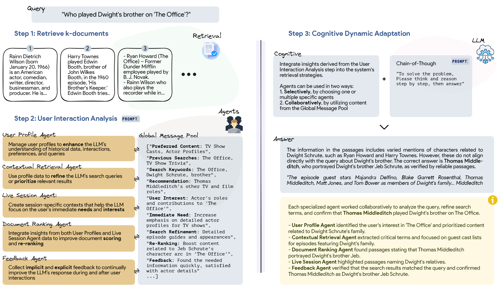

# PersonaRAG: PersonaRAG: Enhancing Retrieval-Augmented Generation Systems with User-Centric Agents

Source code for our paper :  
***PersonaRAG: Enhancing Retrieval-Augmented Generation Systems with User-Centric Agents***


## Overview

PersonaRAG is a novel RAG framework that incorporates user-centric agents to dynamically adapt the retrieval and generation process based on real-time user data and interaction patterns. It employs a multi-agent approach that actively engages with and adapts to user-specific needs and behaviors, enhancing the relevance and accuracy of generated content. The evaluation of PersonaRAG using ChatGPT-4 across various question answering datasets demonstrates its superiority over baseline models, with the capability of providing an answer that is tailored to the user's interaction and information need.

<p align="center">
  
</p>


## Quick Start

### Installation

Clone the repository and install dependencies using Poetry:

```bash
git clone https://github.com/saberzerhoudi/PersonaRAG
cd PersonaRAG
poetry install
```

### Configuration

Set your own API keys in the environment variables:
```bash
export OPENAI_API_KEY='your-openai-api-key'
export OLLAMA_API_KEY='your-ollama-api-key' #Optional
export MIXTRAL_API_KEY='your-mixtral-api-key' #Optional
```

### Running the Scripts

Use the main script to run different functionalities. 
```bash
#To run the model
poetry run python -m scripts.main run --dataset nq --topk 5
#To build results into a CSV
poetry run python -m scripts.main build --dataset nq --topk 5
#To evaluate the model outputs
poetry run python -m scripts.main evaluate --dataset nq --topk 5
```

### Reproduction

We provide our request logs, so the results in the paper can be quickly reproduced:

```bash
poetry run python -m logs.eval --dataset nq --topk 5
```

**Parameters:**

- `dataset`: dataset name (e.g. `nq`, `webq`, `triviaqa`).
- `topk`: using top-k of retrieved passages to augment (i.e. 3, 5)


